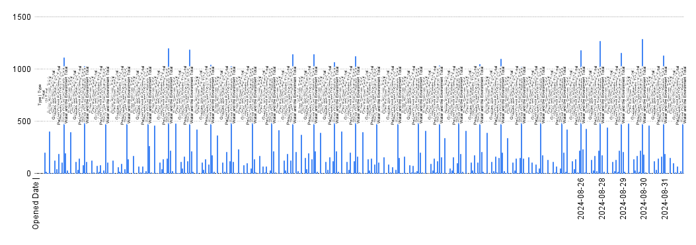

**Date:** 04/11/2024  
**Course Code & Course Name:** MPAD2003A Introductory Data Storytelling (WKS) 
**Student's First Name & Last Name:** Brady Mackay  
**Presented to:** Jean-Sébastien Marier 

# Midterm Project: Exploratory Data Analysis

## What is the dataset?  
The dataset is a collection of requests for services that require action by government workers. And I will be specifically taking a look at it's relationship between the date of the requestand it's description, and whether I can find real life for the flow-change  

Over the course of the month of august 2024 the City of Ottawa has recorded their requests from civilians through 311 Contact Centre, Client Service Centre, 311 Email, and Web-based Self- Service portal. It features information such as the Type of call, Where the report came from, and it's request ID. it also has over 28 000 entries making it quite the dificult set to piece through

* [The City of Ottawa's 2024 Service Requests](https://www.arcgis.com/home/item.html?id=65fe42e2502d442b8a774fd3d954cac5)
* [The Provided, Reduced Dataset of Only Data From August 2024](https://raw.githubusercontent.com/jsmarier/course-datasets/refs/heads/main/ottawa-311-service-requests-august-2024.csv)
* [My Own Document](https://docs.google.com/spreadsheets/d/18DKm0AUgxz66YUWfJEMt_JMu6t9Rvz7rFFsmHvPhXy0/edit?usp=sharing)

## Getting the Data Yourself

To start on your own journey of analyzing this data you'll need to download the data, to do that you'll follow the link above labeled "The Provided, Reduced Dataset of Only Data From August 2024" and if you're connected to the internet you'll find yourself on this screen:   

From there you'd want to rightclick to open the little selection menu and then locate "save as" and click that, and now you've officially downloaded the csv file!  
Now you'll open up a google sheet, name it apropiately and then fine your way to the "file" tab, and from there find the "import" button, once you click on that you'll have to upload the file and wait for it to finish.    
 
Now all there is to do is to set the import location to "Append to current sheet" and your separator type to comma and then just click the import button and your Table should look like this!   
  
### Observations 

Now that we both have the data we can make a couple observations about the content, taking a look at it couple things stand out; the sheer amount of rows, 28538 in the narrowed data to be exact that compared to the 11 columbs it's a huge amount of data to parse through. If you look closely at the dates after scrolling all the way to the bottom you can tell that it doesn't end in august, there is a single datapoint for September first. Other than that outliers though the data looks clean! 
   a couple things to note though, it's very telling that according to this that over 10% of service requests are still active 3 months later! And beyond that 1% of all requests are cancelled. There are 12 different types of requests, including ones that are non-valued but the only two that are like that are "Property Standards - Grass Long/Weeds." and when we're looking at specific addresses only 2% had more than one service call during the month of august and the place with the most is 99 Cobourg St, "MacDonalds Gardens Park" with 18 calls, because it seems to need a lot of maintenence and is a high traffic grafitti spot.    
It makes you wonder, how many calls do they get a day if there are so many entries in just august? does anything specific happen to make the flow of calls increase? what makes a specific place more likely to make calls? I'd think it might be related to the daily events around the location, like a tree falling would get significantly more calls about it.

## 3. Understanding Deep Dive

### 3.1. Analysing Data Using the VIMO Method

Now, let's get into the thick of the data using the VIMO strategy! 
To start, we must identify if datapoints are valid, we look to see if any content is blank or missing or outside of the valid range. VIMO stands for: Valid, Invalid, Missing, Outlier, we will be mostly concentrating on the date the case was opened, and the description of the problem.  The Date Opened: as we talked about before, almost every single date is valid, none are written as something other than a date, and none are missing entirely, but there is a single outlier, the one date outside of August, a call on September first, clearly a mistake by whomever reduced this data. and now the description: again, most datapoints are valid, there are no clearly invalid descriptions, there are no outliers, but there is a strange pattern of missing data. it seems like after august 21 many calls under the type "water and the environment" were left descriptionless, it's very strange that it's only after a certain date, all "water and the environment" type calls got a description in the early days of the month, sadly, we can only speculate what occured

### 3.2. Spring Cleaning

Now to clean up these datapoints we identified as invalid with the VIMO method. the first strategy I employ is to create a filter on the descriptions tab and filter out all of the missing datapoints, though there weren't many there were still enough to mess with the data. Since there was only a single point that is outside of our date range, we'll employ the fool-proof method of manually seaching and deleting it, which for a small number of invalid datapoints is the most effective. I also removed the longitude and latitude columbs due to the fact that they effect very few datapoints. that last thing I did was use the =SPLIT command to remove the french part of the description columb as no other columb had that and it was just cluttering up the visual of the table

**Refrences**

=SPLIT(D?, "|")

### 3.3. The exploration

Exploring this data has revealed some interesting information! such as the fact that I shared originally about the location with the highest amount of outgoing calls, the MacDonalds Gardens Park, but about 2% of places call twice in this month. Upon seeing the data I was right away interested in seeing if any events had caused more incoming service calls on that specific days, like a storm or a crime. It was pointed out to me that the reason why a couple days had more calls than others is probably because they were closer to the weekend and when I looked I found out that the lowest days to call in were mondays and tuesdays, which is right when the week starts. I think there's deifinetly a potential story waiting in either MacDoalds Gardens Park calling so often and why that was, or looking to find if any events occured that caused more calls on that day or following couple. I am going to go on to put more reasearch into Macdonalds Gardens Park, and adding other keywords like grafitti or maintenece.

**My Pivot Tables**
 
this is the pivot table I made at the very start of the project as I was getting aclimatized to the dataset and I really liked the questions it raised for me, I'll get more into those in the story section
  
 
this is a newer version to look at the descriptions within the types and see what gets called most, quite facinating.

**My Exploratory Chart** 

 This chart (poorly) depicts the second pivot chart above, viewing each total next to eachother allows for a better picture.

## 4. Potential Story

**MacDonald Gardens Park, Is It Really That Run Down?**  
You're walking down Cobourg Street with your family and you find yourself passing a familiar park, MacDonald Gardens Park, but it's not quite the same, it's a little different. there's a huge sheet of plastic wrap wrapped around trees with graffiti on it! (that actually did happen 12 years ago) you remember that not to long ago there was a consultation and survey for a potential plan to improve this park in the future and you think this needs to go to their attention. hours late after the family outing you still find yourself thinking about it and see if you can look that survey up, see if you could possibly still get a word in, sadly, it was closed months ago, but there is a page that you find with a status update in the progression of the potential work and it offers a comment section that allows for suggestions to be brought up! You feel good about going down this rabbit hole, and helping your city. though that tale wasn't necesarily true, it is my best (with evidence) theory about why there were so many service calls for MacDonald Gardens Park, all but one of the eighteen were web based suggestions and I found this update on the conservation plan by searching up keywords! I'm honestly quite proud of my find.
 
* [Macdonald Gardens Park - Park Conservation Plan](https://engage.ottawa.ca/macdonald-gardens-park-park-conservation-plan?tool=guest_book)
* [Reddit post depicting the graffiti](https://www.reddit.com/r/ottawa/comments/9n9ppw/grafiti_i_saw_on_saran_wrap_between_2_trees_in/)

## 5. Conclusion

After I got to work on this project I genuinely started to have a lot of fun, finding connections between the data and real life made me... embarrasingly excited.  
The most challenging part of this assignment for me was getting started, looking at the sheer amount it looked so great so many words, so many tasks, so many charts, it was really quite scary. Once I started going I found how stupidly fun it was. A more physical thing that troubled me was a proble I had during class on the 6th, I panicked because I just couldn't figure out why there were no descriptions for the latter half of my data!!! it took me way too wrong to find out I copied the data wrong and messed up when I was doing the split function.  
If I could do it again I would definetly make my scope wider, accounting for more datapoints, finding more connections. But to do that, I would have needed to start earlier, so that's a thing I really need to work on, I also need to work on remembering in class discussion more so I could have more examples of this type of things. but in the end I had fun! 

## 6. References

Correia, D. (n.d.). Macdonald Gardens Park - Park Conservation Plan. Engage Ottawa. https://engage.ottawa.ca/macdonald-gardens-park-park-conservation-plan?tool=guest_book 
 
u/Solarbg. (2018, October 11). Grafiti i saw on saran wrap between 2 trees in MacDonad Gardens Park (picture from 6 years ago). Reddit. https://www.reddit.com/r/ottawa/comments/9n9ppw/grafiti_i_saw_on_saran_wrap_between_2_trees_in/ 

